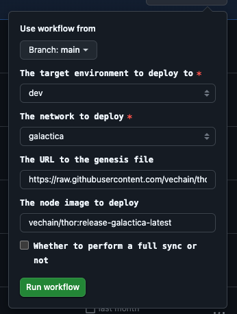

# Documentation *(Work in Progress)*

This documentation is a work in progress and will be updated as new features are added.

With the Galactica hardfork, the following API endpoints and flags are introduced.

## Endpoints

- `fees/history`: Similar to [`eth_feeHistory`](https://docs.metamask.io/services/reference/ethereum/json-rpc-methods/eth_feehistory/), this endpoint allows you to retrieve information about a range of block base fees and gas used ratios.

    _Request parameters_:

    - `blockCount`: The number of blocks to retrieve.
    - `newestBlock`: The highest block number to retrieve, its value is a `revision` following the existing VeChainThor endpoints.

    _Response parameters_:
    The range might not necessarily be `newestBlock` - `blockCount` if the oldest block does not exist or is not included due to the backtrace limit (see flags below for more details about this limit). `blockCount` can be higher than the backtrace limit, but the response will include only values within the valid range.

    - `oldestBlock`: The oldest block in the requested range.
    - `baseFees`: An array of block base fees for the requested range.
    - `gasUsedRatios`: An array of gas ratios (block gas used divided by the block gas limit) for the requested range.

- `fees/priority`: Similar to [`eth_maxPriorityFeePerGas`](https://docs.metamask.io/services/reference/ethereum/json-rpc-methods/eth_maxpriorityfeepergas/), this endpoint suggests a tip that is sufficient to be included as the `maxPriorityFeePerGas` value in a transaction, ensuring it is included in the closest possible block.

    _Response parameters_:
    - `maxPriorityFeePerGas`: The tip value to be used as the `maxPriorityFeePerGas` in a transaction (also to be considered for `maxFeePerGas` since it is the block base fee plus this tip).

The full definition of the endpoints can be found in [thor.yaml](../../thor/api/doc/thor.yaml).

## Flags

New flags have been introduced to configure the behavior of Galactica. As mentioned in the endpoints, the existing backtrace limit is used by `fees/history`:

- `--api-priority-fees-percentage`: This is a percentage applied to the most recent block base fee (`next`) to suggest a tip for the `fees/priority` endpoint. The default value is 5 (5%).
- `--min-effective-priority-fee`: The minimum effective priority (the minimum between `maxPriorityFeePerGas` and `maxFeePerGas - block base fee`) that can be used in a transaction. The default value is 0, so this flag is optional.
- `--api-backtrace-limit`: The backtrace limit, starting from the `best` block. The default value is 1000.

A full up-to-date description of the flags can be found in the [usage documentation](../../thor/docs/usage.md#command-line-options).

## Run Galactica with Thor Solo

To run Galactica with Thor Solo, follow the instructions [here](../../thor/docs/usage.md#thor-solo).

The only difference will be the location of the binary, which is `thor/bin/thor` from the root folder of this repository. All the flags and endpoints mentioned above apply.

## Use Galactica on Devnet

Currently Galactica is deployed in Devnet at this URL https://galactica.green.dev.node.vechain.org/.

If a new version has to be deployed, you need to trigger a GitHub Action [from this repo](https://github.com/vechain/node-hosting/actions/workflows/deploy.yml). The image selected there is created every time there is a new commit in the `release/galactica` branch at the [VeChainThor repository](https://github.com/vechain/thor/tree/release/galactica):

   