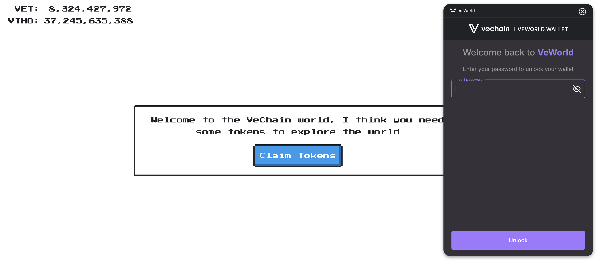
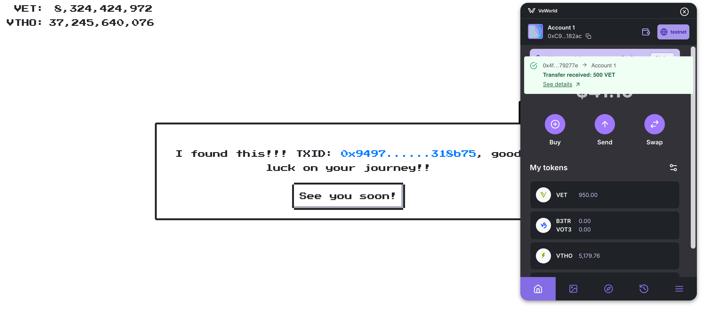

# Faucet Instructions

This document will guide you through the steps to obtain VET and VTHO for the testnet. VTHO is the token used for gas in VeChain. More details about these tokens can be found [here](https://docs.vechain.org/introduction-to-vechain/dual-token-economic-model).

We will be using [VeChain Faucet](https://faucet.vecha.in/). The main prerequisite is to have a wallet, such as [VeWorld](https://chromewebstore.google.com/detail/veworld/ffondjhiilhjpmfakjbejdgbemolaaho?pli=1), installed in your browser.

## Steps

1. Navigate to the faucet website and click on the `Claim Tokens` button. This will bring up the VeWorld extension:

   

2. Within VeWorld, click on the `Sign` button to `Sign Certificate`.

That's it! You should now see a confirmation indicating that you have received VET and VTHO (500 and 50, respectively):

   

With these tokens, you can start working on the VeChain testnet. Remember that you can swap VET for VTHO if you need more funds, using VeWorld for that purpose.